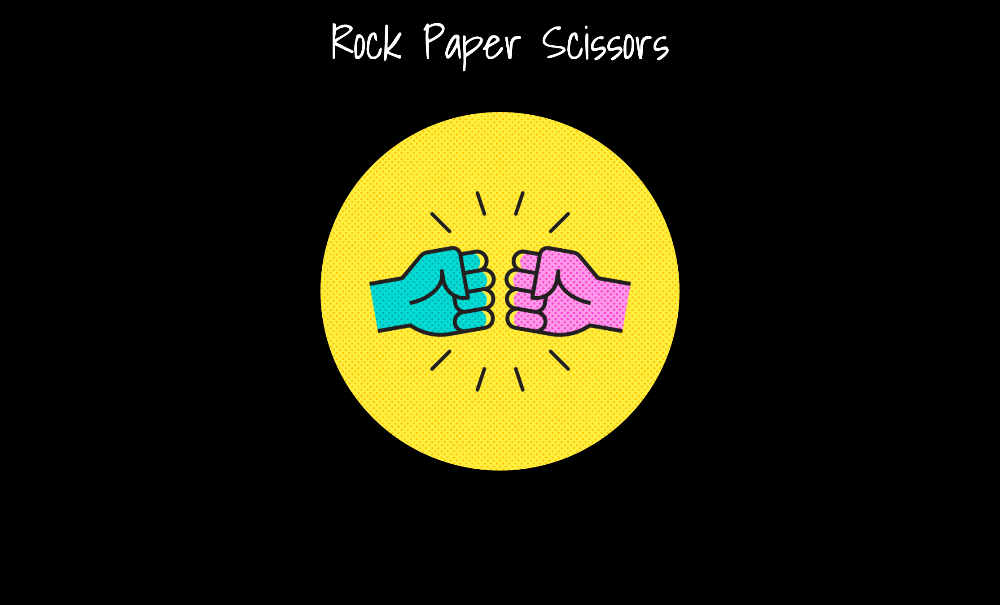
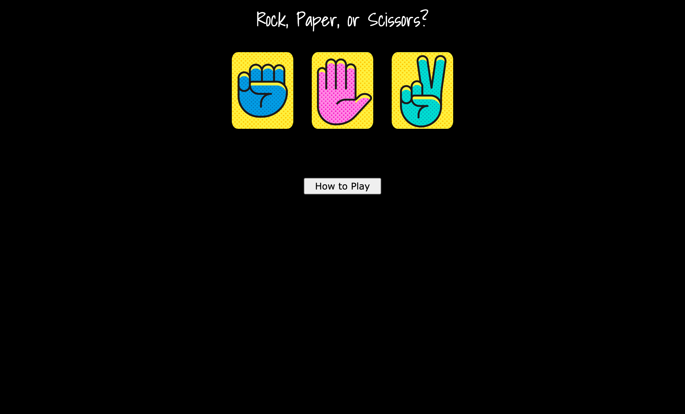
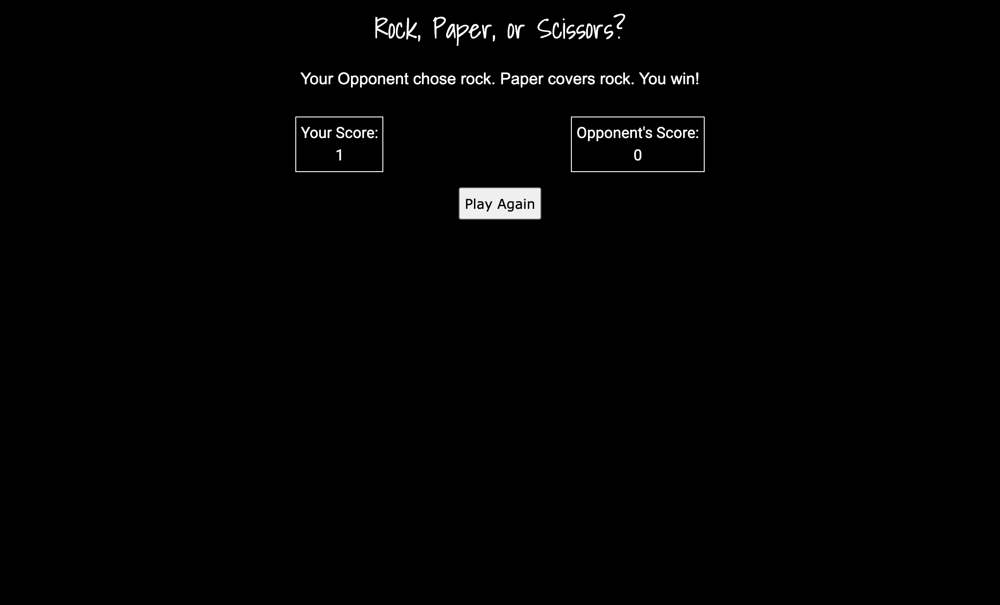
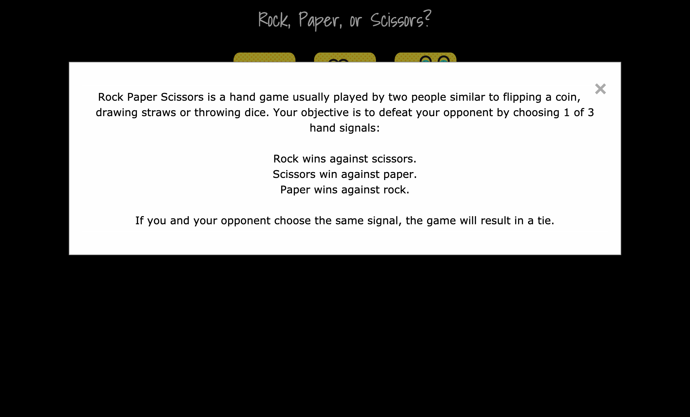

# Rock Paper Scissor
My version of the classic game written using W3.CSS and vanilla Javascript.

Live version here: https://veronicaadler.github.io/rock_paper_scissor/

## Frameworks Used
W3.CSS

## Motivation
The motivation for this project was to practice using vanilla Javascript HTML DOM methods as well as styling in CSS.

## Getting Started
Make a pull request to fork and clone the repo to your local machine.  For instructions, see here: https://www.freecodecamp.org/news/how-to-make-your-first-pull-request-on-github-3/.

## Acknowledgements
This app utilizes free graphics designed by nightwolfdezines on Vecteezy.com: https://www.vecteezy.com/members/nightwolfdezines.

This app also utilizes free audio from the following creators on Freesound.org:

Failure scenario audio by ProjectsU012: https://freesound.org/people/ProjectsU012/sounds/333785/
Win scenario audio by syseQL: https://freesound.org/people/syseQ/sounds/267528/
Stalemate scenario audio by MakoFox: https://freesound.org/people/MakoFox/sounds/126428/

## Screenshots

